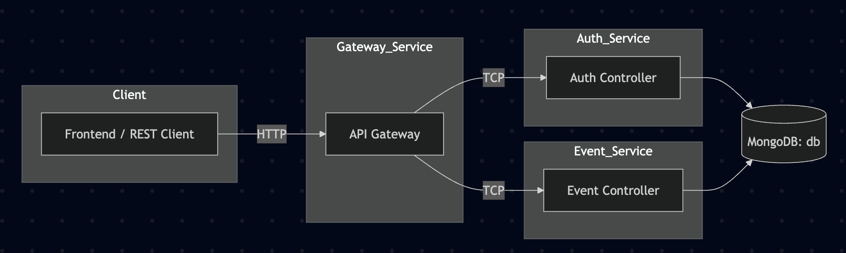
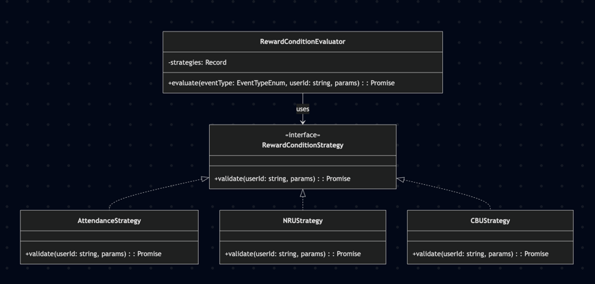
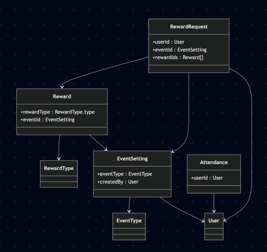

<div align="center">


</div>

NestJS 기반 MSA 프로젝트로, 인증(Auth), 게이트웨이(Gateway), 이벤트/보상(Event) 마이크로서비스로 구성되어 있습니다.  
MongoDB 및 TCP 기반 내부 통신, Docker Compose 기반 배포 환경을 지원합니다.

---

## 📁 프로젝트 구조

```text
.
├── apps/
│ ├── auth/ # 인증 서비스
│ ├── gateway/ # API 게이트웨이 (라우팅 + 인증)
│ └── event/ # 이벤트 및 보상 처리
├── docker-compose.yml
├── .env
├── docs # 설계 문서
└── README.md
```



## 👷 Docker 기반 실행

```shell
docker compose down -v --remove-orphans  # (옵션) 모든 컨테이너/볼륨 삭제
docker compose up --build                # 소스/환경 변경 반영하여 올리기
```

🧱 기술 스택

- NestJS (TCP microservice, Guards, Decorators)
- MongoDB (Mongoose ODM)
- Docker / Docker Compose
- Swagger (API 문서 자동화)
- Strategy Pattern (보상 조건 평가)

## 🧩 Swagger API 문서

- 경로: http://localhost:3000/docs
- 인증 필요: Bearer Token (로그인 후 access_token 사용)

## 👥 역할별 권한

| 역할       | 권한 설명               |
|----------|---------------------|
| USER     | 보상 요청, 내 이력 조회 가능   |
| OPERATOR | 이벤트/보상 등록, 요청 목록 조회 |
| AUDITOR  | 지급 이력 조회만 가능        |
| ADMIN    | 모든 권한, 유저 역할 변경 가능  |

## 보상 구조 설계



| 구성                         | 설명                    |
|----------------------------|-----------------------|
| `RewardConditionStrategy`  | 인터페이스: 전략 패턴의 핵심 역할   |
| `*Strategy` 클래스            | 각각의 보상 조건에 특화된 검증 클래스 |
| `RewardConditionEvaluator` | 이벤트 타입별로 전략을 선택해 실행   |

## 이벤트 설계

### 🎯 1. 출석 보상 이벤트 (Attendance Reward)

✅ 개요

- 사용자가 지속적으로 게임에 접속하며 출석한 것을 보상하는 이벤트입니다.

✅ 조건 예시

- 이벤트 기간 동안 7일 연속 출석
- 출석 날짜는 MongoDB의 Attendance 컬렉션으로 관리됨

✅ 사용 목적

- 유저의 지속적인 참여 유도
- 일일 활성 유저 수(DAU) 증가

✅ 전략 적용

- AttendanceStrategy를 통해 연속 출석일 계산 및 조건 만족 여부 판단

### 🆕 2. 신규 유저 보상 이벤트 (NRU: New Registered User)

✅ 개요

- 가입한지 얼마 안 된 유저(NRU)에게 즉시 보상을 제공하는 이벤트입니다.

✅ 조건 예시

- 가입 후 3일 이내 보상 요청 가능
- 유저의 createdAt 기준 계산

✅ 사용 목적

- 초기 이탈 방지
- 신규 유저의 정착률 향상

✅ 전략 적용

- NRUStrategy를 통해 createdAt 기반 신규 여부 판단

### 🔁 3. 컴백 유저 보상 이벤트 (CBU: Comeback User)

✅ 개요

- 한동안 게임에 접속하지 않다가 복귀한 유저에게 제공되는 이벤트입니다.

✅ 조건 예시

- 마지막 접속일 기준 30일 이상 미접속
- 유저의 lastLoginAt 기준 계산

✅ 사용 목적

- 휴면 유저 복귀 유도
- 게임 라이프사이클 연장

✅ 전략 적용

- CBUStrategy를 통해 lastLoginAt 기준으로 컴백 여부 판단

| 이벤트 타입 | 번호 | 주요 대상     | 조건 기준        | 사용 전략                |
|--------|----|-----------|--------------|----------------------|
| 출석 보상  | 1  | 지속 활동 유저  | N일 연속 출석     | `AttendanceStrategy` |
| NRU    | 2  | 신규 가입 유저  | 가입 후 N일 이내   | `NRUStrategy`        |
| CBU    | 3  | 장기 미접속 유저 | 마지막 로그인 N일 전 | `CBUStrategy`        |


## MongoDB Schema 



## 🚀 배포 확장 고려사항

### ✅ Kubernetes 배포
- 각 서비스(auth, gateway, event)를 개별 Pod로 구성
- 내부 통신은 TCP, DNS 기반 서비스명(auth, event) 사용
- 환경변수는 ConfigMap/Secret으로 관리
- MongoDB는 StatefulSet 또는 외부 Atlas 사용 가능
- CI/CD에는 ArgoCD, GitHub Actions 등을 활용해 GitOps 기반 배포 가능

### 🧩 Monorepo vs Polyrepo
| 항목 | Monorepo        | Polyrepo        |
| -- | --------------- | --------------- |
| 구조 | 모든 서비스 1개 리포    | 서비스별 리포 분리      |
| 장점 | 코드 공유 쉬움, 통합 빌드 | 독립성 높음, 팀 분리 용이 |
| 단점 | 리포 무거움, 충돌 ↑    | 공통 코드 관리 복잡     |
| 추천 | 소규모 팀, 초기 개발    | 서비스 확장, 다수 팀 운영 |


---
🧑‍💻 개발자
Author: @sangjinsu

Contact: climbplant39@kakao.com